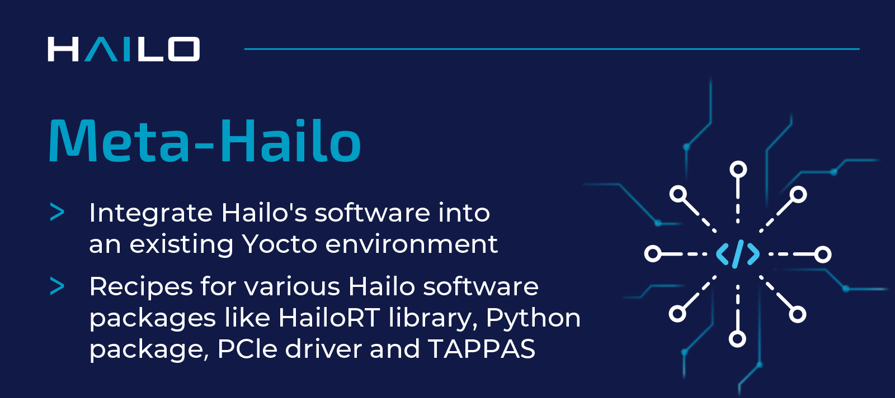

  

# Meta-Hailo #

Hailo’s Yocto layers allow the user to integrate Hailo’s software into an existing Yocto environment. They include recipes
for:
- [**PCIe driver**](https://github.com/hailo-ai/hailort-drivers)
- Hailo-8 firmware
- HailoRT GStreamer library implementing the HailoNet element
- [**HailoRT library**](https://github.com/hailo-ai/hailort)
- pyHailoRT - HailoRT Python API (wraps the run-time library)
- Hailo [**TAPPAS**](https://github.com/hailo-ai/tappas) - framework for optimized execution of video-processing pipelines

## Usage

See [**hailo.ai developer zone documentation**](https://hailo.ai/developer-zone/documentation/hailort/latest/) (registration is required for  full documentation access).

## Changelog

See [**hailo.ai developer zone - HailoRT changelog**](https://hailo.ai/developer-zone/documentation/hailort/latest/?sp_referrer=changelog/changelog.html) (registration required).

## Contact

Contact information and support is available at [**hailo.ai**](https://hailo.ai/contact-us/).

## About Hailo-8™

Hailo-8 is a deep learning processor for edge devices. The Hailo-8 provides groundbraking efficiency for neural network deployment.
The Hailo-8 edge AI processor, featuring up to 26 tera-operations per second (TOPS), significantly outperforms all other edge processors.
Hailo-8 is available in various form-factors, including the Hailo-8 M.2 Module.

The Hailo-8 AI processor is designed to fit into a multitude of smart machines and devices, for a wide variety of sectors including Automotive, Smart Cities, Industry 4.0,
Retail and Smart Homes.

For more information, please visit [**hailo.ai**](https://hailo.ai/).
