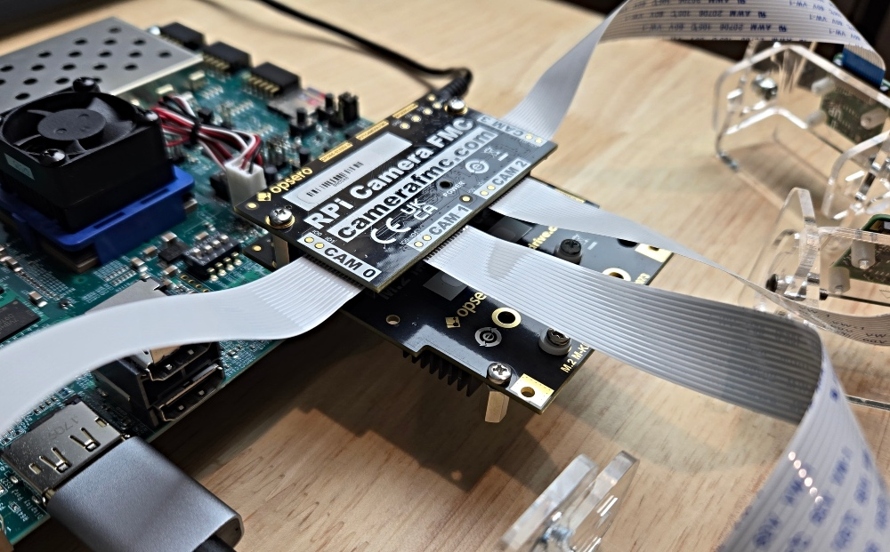

# Build instructions

## Source code

The source code for the reference designs is managed on this Github repository:

* [https://github.com/fpgadeveloper/zynqmp-hailo-ai](https://github.com/fpgadeveloper/zynqmp-hailo-ai)

Note that the repository contains submodules, so it is essential to use the `--recursive` option when cloning:
```
git clone --recursive https://github.com/fpgadeveloper/zynqmp-hailo-ai.git
```

## License requirements

The designs for all of the [target boards](supported_carriers) can be built with the Vivado ML Standard 
Edition **without a license**.

(target-designs)=
## Target designs

This repo contains several designs that target the various supported development boards and their
FMC connectors. The table below lists the target design name, the camera ports supported by the design and 
the FMC connector on which to connect the [RPi Camera FMC].

Note that there are two target designs for the [ZCU106] board: `zcu106` and `zcu106_hpc0`, and the
differences are explained in the table below.
All target designs except `zcu106` require the [M.2 M-key Stack FMC] as the M.2 adapter for the Hailo-8, with the
[RPi Camera FMC] stacked on top of it.


    
    
        
            
        
    
    
### {{ group.name }} designs

| Target board        | Target design     | Cameras | M.2 <br>Active <br>Slots | FMC Slot    | VCU | Stack Design | Vivado<br> Edition |
|---------------------|-------------------|---------|------------------|-------------|-----|-----|-----|
| [{{ design.board }}]({{ design.link }}) | `{{ design.label }}` | {{ design.cams | length }} | {{ design.lanes | length }} | {{ design.connector }} |  ✅  ❌  |  ✅  ❌  | {{ "Enterprise" if design.license else "Standard 🆓" }} |




#### Notes:
1. The Vivado Edition column indicates which designs are supported by the Vivado *Standard* Edition, the
   FREE edition which can be used without a license. Vivado *Enterprise* Edition requires
   a license however a 30-day evaluation license is available from the AMD Xilinx Licensing site.
2. The Stack Designs use the [M.2 M-key Stack FMC] with the [RPi Camera FMC] stacked on top of it. The non-stack
   designs use the [FPGA Drive FMC Gen4] on one FMC connector, and the [RPi Camera FMC] on another.
3. The `zcu106` target design uses the [FPGA Drive FMC Gen4] as the M.2 adapter for the Hailo-8.
   In that design, the [FPGA Drive FMC Gen4] connects to HPC1 while the [RPi Camera FMC] connects
   to the HPC0 connector.
4. The `pynqzu` and `genesyszu` target designs have video pipelines for only 2 cameras (CAM1 and CAM2 as
   labelled on the RPi Camera FMC). This is due to the resource limitations of the devices on these boards.
5. The `zcu106_hpc0` and `uzev` target designs have support for 2x M.2 modules. To use the Hailo demo scripts,
   at least one of these modules must be the [Hailo-8 M.2 AI Acceleration Module]. The second slot can be used
   for a second Hailo module, or an NVMe SSD for storage.

### Stack designs

The "stack" designs are intended to be used with the [RPi Camera FMC] stacked on top of the [M.2 M-key Stack FMC]
as shown in the image below. This setup allows both the [RPi Camera FMC] and the M.2 adapter to be 
connected to the carrier board through a single FMC connector.



### Non-stack design

The single non-stack design for [ZCU106] (target design `zcu106`) is intended to be used with the [RPi Camera FMC] on connector HPC0 and
the [FPGA Drive FMC Gen4] on connector HPC1 as shown in the image below.


## Linux only

These projects can be built using a machine (either physical or virtual) with one of the 
[supported Linux distributions].

```{tip} The build steps can be completed in the order shown below, or
you can go directly to the [build PetaLinux](#build-petalinux-project) instructions below
to build the Vivado and PetaLinux projects with a single command.
```

### Build Vivado project

1. Open a command terminal and launch the setup script for Vivado:
   ```
   source <path-to-vivado-install>/2024.1/settings64.sh
   ```
2. Clone the Git repository and `cd` into the `Vivado` folder of the repo:
   ```
   git clone --recursive https://github.com/fpgadeveloper/zynqmp-hailo-ai.git
   cd zynqmp-hailo-ai/Vivado
   ```
3. Run make to create the Vivado project for the target board. You must replace `<target>` with a valid
   target (alternatively, skip to step 5):
   ```
   make project TARGET=<target>
   ```
   Valid target labels are:
    `{{ design.label }}`{{ ", " if not loop.last else "." }} 
   That will create the Vivado project and block design without generating a bitstream or exporting to XSA.
4. Open the generated project in the Vivado GUI and click **Generate Bitstream**. Once the build is
   complete, select **File->Export->Export Hardware** and be sure to tick **Include bitstream** and use
   the default name and location for the XSA file.
5. Alternatively, you can create the Vivado project, generate the bitstream and export to XSA (steps 3 and 4),
   all from a single command:
   ```
   make xsa TARGET=<target>
   ```
   
(build-petalinux-project)=
### Build PetaLinux project

These steps will build the PetaLinux project for the target design. You are not required to have built the
Vivado design before following these steps, as the Makefile triggers the Vivado build for the corresponding
design if it has not already been done.

1. Launch the setup script for Vivado (only if you skipped the Vivado build steps above):
   ```
   source <path-to-vivado-install>/2024.1/settings64.sh
   ```
2. Launch PetaLinux by sourcing the `settings.sh` bash script, eg:
   ```
   source <path-to-petalinux-install>/2024.1/settings.sh
   ```
3. Build the PetaLinux project for your specific target platform by running the following
   command, replacing `<target>` with a valid value from below:
   ```
   cd PetaLinux
   make petalinux TARGET=<target>
   ```
   Valid target labels for PetaLinux projects are:
    `{{ design.label }}`{{ ", " if not loop.last else "." }} 
   Note that if you skipped the Vivado build steps above, the Makefile will first generate and
   build the Vivado project, and then build the PetaLinux project.

### Build issue and workaround

When building the PetaLinux project, you might experience one or more of the following error messages:

```
ERROR: hailortcli-4.19.0-r0 do_configure: ExecutionError('/home/user/zynqmp-hailo-ai/PetaLinux/zcu106/build/tmp/work/cortexa72-cortexa53-xilinx-linux/hailortcli/4.19.0-r0/temp/run.do_configure.2849196', 1, None, None)
ERROR: Logfile of failure stored in: /home/user/zynqmp-hailo-ai/PetaLinux/zcu106/build/tmp/work/cortexa72-cortexa53-xilinx-linux/hailortcli/4.19.0-r0/temp/log.do_configure.2849196
ERROR: Task (/home/user/zynqmp-hailo-ai/PetaLinux/zcu106/project-spec/meta-user/meta-hailo/meta-hailo-libhailort/recipes-hailo/hailortcli/hailortcli_4.19.0.bb:do_configure) failed with exit code '1'
ERROR: libhailort-4.19.0-r0 do_configure: ExecutionError('/home/user/zynqmp-hailo-ai/PetaLinux/zcu106/build/tmp/work/cortexa72-cortexa53-xilinx-linux/libhailort/4.19.0-r0/temp/run.do_configure.2851680', 1, None, None)
ERROR: Logfile of failure stored in: /home/user/zynqmp-hailo-ai/PetaLinux/zcu106/build/tmp/work/cortexa72-cortexa53-xilinx-linux/libhailort/4.19.0-r0/temp/log.do_configure.2851680
ERROR: Task (/home/user/zynqmp-hailo-ai/PetaLinux/zcu106/project-spec/meta-user/meta-hailo/meta-hailo-libhailort/recipes-hailo/libhailort/libhailort_4.19.0.bb:do_configure) failed with exit code '1'
```

If you open one of the logfiles of those error messages, you will find error messages that are similar to the following:

```
Cloning into 'protobuf-src'...
fatal: unable to access 'https://github.com/protocolbuffers/protobuf.git/': error setting certificate file: /usr/local/oe-sdk-hardcoded-buildpath/sysroots/x86_64-petalinux-linux/etc/ssl/certs/ca-certificates.crt
```

#### Explanation:

In order to build the meta-hailo recipes, PetaLinux needs to clone some repositories. To do this, it requires 
a digital certificate that is expecting to find in path `/usr/local/oe-sdk-hardcoded-buildpath/sysroots/x86_64-petalinux-linux/etc/ssl/certs/`.
The correct location of the certificate is `/<petalinux-install-path>/2024.1/sysroots/x86_64-petalinux-linux/etc/ssl/certs/`.

#### Work-around:

As a work-around to this issue, we suggest creating a symbolic link so that PetaLinux finds the digital certificate
where it is expecting to find it.

```
sudo mkdir -p /usr/local/oe-sdk-hardcoded-buildpath/sysroots/x86_64-petalinux-linux/etc/ssl/certs/
sudo ln -s /<petalinux-install-path>/2024.1/sysroots/x86_64-petalinux-linux/etc/ssl/certs/ca-certificates.crt /usr/local/oe-sdk-hardcoded-buildpath/sysroots/x86_64-petalinux-linux/etc/ssl/certs/ca-certificates.crt
```

Note that before running the commands, you must replace `<petalinux-install-path>` with the correct path to your PetaLinux
installation. After running the above commands, delete the failed PetaLinux project (eg. `cd PetaLinux & rm -rf pynqzu`) and re-run make.

### PetaLinux offline build

If you need to build the PetaLinux projects offline (without an internet connection), you can
follow these instructions.

1. Download the sstate-cache artefacts from the Xilinx downloads site (the same page where you downloaded
   PetaLinux tools). There are four of them:
   * aarch64 sstate-cache (for ZynqMP designs)
   * arm sstate-cache (for Zynq designs)
   * microblaze sstate-cache (for Microblaze designs)
   * Downloads (for all designs)
2. Extract the contents of those files to a single location on your hard drive, for this example
   we'll say `/home/user/petalinux-sstate`. That should leave you with the following directory 
   structure:
   ```
   /home/user/petalinux-sstate
                             +---  aarch64
                             +---  arm
                             +---  downloads
                             +---  microblaze
   ```
3. Create a text file called `offline.txt` in the `PetaLinux` directory of the project repository. The file should contain
   a single line of text specifying the path where you extracted the sstate-cache files. In this example, the contents of 
   the file would be:
   ```
   /home/user/petalinux-sstate
   ```
   It is important that the file contain only one line and that the path is written with NO TRAILING 
   FORWARD SLASH.

Now when you use `make` to build the PetaLinux projects, they will be configured for offline build.

[supported Linux distributions]: https://docs.amd.com/r/en-US/ug1144-petalinux-tools-reference-guide/Setting-Up-Your-Environment
[M.2 M-key Stack FMC]: https://www.fpgadrive.com/docs/m2-mkey-stack-fmc/overview/
[FPGA Drive FMC Gen4]: https://www.fpgadrive.com/docs/fpga-drive-fmc-gen4/overview/
[RPi Camera FMC]: https://camerafmc.com/docs/rpi-camera-fmc/overview/
[ZCU106]: https://www.xilinx.com/zcu106
