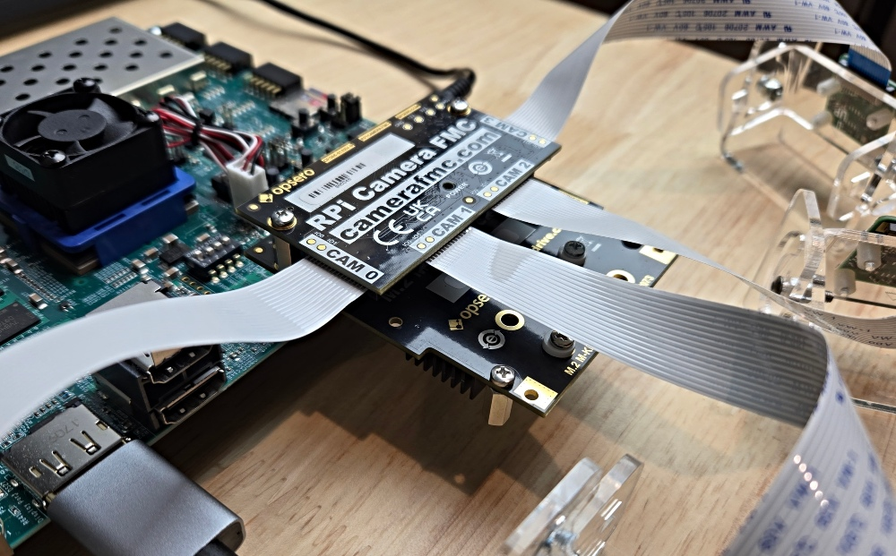

# Build instructions

## Source code

The source code for the reference designs is managed on this Github repository:

* [https://github.com/fpgadeveloper/zynqmp-hailo-ai](https://github.com/fpgadeveloper/zynqmp-hailo-ai)

Note that the repository contains submodules, so it is essential to use the `--recursive` option when cloning:
```
git clone --recursive https://github.com/fpgadeveloper/zynqmp-hailo-ai.git
```

## License requirements

The designs for all of the [target boards](supported_carriers) can be built with the Vivado ML Standard 
Edition **without a license**.

(target-designs)=

Additionally, some designs use IP cores that are licensed separately from the Vivado edition itself (for example: TEMAC, XXV Ethernet, HDMI). The **IP License** column in the tables below indicates the designs that require such a license to generate a bitstream; evaluation licenses are generally available from AMD for testing.

## Target designs

This repo contains several designs that target the various supported development boards and their
FMC connectors. The table below lists the target design name, the camera ports supported by the design and 
the FMC connector on which to connect the [RPi Camera FMC].

Note that there are two target designs for the [ZCU106] board: `zcu106` and `zcu106_hpc0`, and the
differences are explained in the table below.
All target designs except `zcu106` require the [M.2 M-key Stack FMC] as the M.2 adapter for the Hailo-8, with the
[RPi Camera FMC] stacked on top of it.


    
    
        
            
        
    
    
### {{ group.name }} designs

| Target board        | Target design     | Cameras | M.2 <br>Active <br>Slots | FMC Slot    | VCU | Stack Design | Vivado<br> Edition | IP<br>License |
|---------------------|-------------------|---------|------------------|-------------|-----|-----|-----|-----|
| [{{ design.board }}]({{ design.link }}) | `{{ design.label }}` | {{ design.cams | length }} | {{ design.lanes | length }} | {{ design.connector }} |  ✅  ❌  |  ✅  ❌  | {{ "Enterprise" if design.license else "Standard 🆓" }} | {{ "Required" if design.ip_license else "-" }} |




#### Notes:
1. The Vivado Edition column indicates which designs are supported by the Vivado *Standard* Edition, the
   FREE edition which can be used without a license. Vivado *Enterprise* Edition requires
   a license however a 30-day evaluation license is available from the AMD Xilinx Licensing site.
2. The Stack Designs use the [M.2 M-key Stack FMC] with the [RPi Camera FMC] stacked on top of it. The non-stack
   designs use the [FPGA Drive FMC Gen4] on one FMC connector, and the [RPi Camera FMC] on another.
3. The `zcu106` target design uses the [FPGA Drive FMC Gen4] as the M.2 adapter for the Hailo-8.
   In that design, the [FPGA Drive FMC Gen4] connects to HPC1 while the [RPi Camera FMC] connects
   to the HPC0 connector.
4. The `pynqzu` target design has video pipelines for only 2 cameras (CAM1 and CAM2 as
   labelled on the RPi Camera FMC). This is due to the resource limitations of the device on this board.
5. The `zcu106_hpc0` and `uzev` target designs have support for 2x M.2 modules (two Gen3 x4 root ports).
   To use the Hailo demo scripts, at least one of these modules must be the
   [Hailo-8 M.2 AI Acceleration Module], in M.2 slot 1. The second slot can be used for a second Hailo
   module, or an NVMe SSD for storage. All other target designs have a single Gen3 x1 link to M.2 slot 1:
   on `zcu106`, the HPC1 connector carries only one GT lane, so the second M.2 slot of the
   [FPGA Drive FMC Gen4] is not connected and cannot be used.

### Stack designs

The "stack" designs are intended to be used with the [RPi Camera FMC] stacked on top of the [M.2 M-key Stack FMC]
as shown in the image below. This setup allows both the [RPi Camera FMC] and the M.2 adapter to be 
connected to the carrier board through a single FMC connector.



### Non-stack design

The single non-stack design for [ZCU106] (target design `zcu106`) is intended to be used with the [RPi Camera FMC] on connector HPC0 and
the [FPGA Drive FMC Gen4] on connector HPC1 as shown in the image below.


## Cross-platform build runner

All builds are driven by the `build.py` runner at the root of the repository,
on **both Windows and Linux** — the build instructions are the same for the
two operating systems. Each command builds whatever it depends on
automatically, skips anything that is already built, and locates the AMD
tools itself, so there is no need to source the settings scripts beforehand.

On Linux and on Windows (git bash), commands are run with the `build.sh`
shim, which finds a suitable Python 3 automatically (including the
interpreter bundled with the AMD tools). Windows users who prefer not to
use git bash can run the same commands from Command Prompt or PowerShell
using `build.bat` instead — the commands and arguments are otherwise
identical, for example `build.bat xsa --target <target>`.

This repository uses git submodules: clone it with `--recurse-submodules`,
or run `git submodule update --init` in an existing clone, before building.

To see the available targets and the state of a build:

```
./build.sh list                       # list the targets and their attributes
./build.sh status --target <target>   # show the per-stage artifact state
./build.sh clean --target <target>    # delete a target's generated outputs
```

```{note}
The embedded Linux images (PetaLinux and Yocto) can only be built on a
native Linux machine; everything else builds on Windows too. On Windows, the
runner refuses the Linux-only stages up front and prints the exact command
to run on the Linux machine.
```

```{attention}
The legacy `make` interface described in previous versions of
this documentation still works on Linux — each Makefile is now a thin
wrapper around `build.sh` — but it is deprecated and will be removed at the
next version update.
```

### Build Vivado project

This single command creates the Vivado project, generates the bitstream and
exports the hardware to an XSA file:

```
./build.sh xsa --target <target>
```

Valid targets are:
 `{{ design.label }}`{{ ", " if not loop.last else "." }} 

The HLS IP on which the design depends is generated automatically before
the project is created. It can also be generated on its own with
`./build.sh ip --target <target>`.

If you want the Vivado project and block design without generating a
bitstream — for example, to explore or modify the design in the Vivado GUI —
run `./build.sh project --target <target>` instead, then open the project
from `Vivado/<target>/`.

### Build PetaLinux

The PetaLinux build requires a native Linux machine (one of the [supported
Linux distributions]) with PetaLinux Tools 2025.2 installed. The runner
locates and sources the PetaLinux `settings.sh` itself, and builds the
Vivado XSA first if it does not already exist:

```
./build.sh petalinux --target <target>
```

Valid targets for PetaLinux are:
 `{{ design.label }}`{{ ", " if not loop.last else "." }} 

The output products are written to `PetaLinux/<target>/images/linux/`.

#### PetaLinux offline build

If you need to build the PetaLinux projects offline (without an internet
connection), you can follow these instructions.

1. Download the sstate-cache artefacts from the Xilinx downloads site (the
   same page where you downloaded PetaLinux tools). There are four of them:
   * aarch64 sstate-cache (for ZynqMP designs)
   * arm sstate-cache (for Zynq designs)
   * microblaze sstate-cache (for Microblaze designs)
   * Downloads (for all designs)
2. Extract the contents of those files to a single location on your hard
   drive, for this example we'll say `/home/user/petalinux-sstate`. That
   should leave you with the following directory structure:
   ```
   /home/user/petalinux-sstate
                             +---  aarch64
                             +---  arm
                             +---  downloads
                             +---  microblaze
   ```
3. Create a text file called `offline.txt` in the `PetaLinux` directory of
   the project repository. The file should contain a single line of text
   specifying the path where you extracted the sstate-cache files. In this
   example, the contents of the file would be:
   ```
   /home/user/petalinux-sstate
   ```
   It is important that the file contain only one line and that the path is
   written with NO TRAILING FORWARD SLASH.

The PetaLinux builds will then be configured for offline build.

### Build Yocto

The Yocto / EDF build also requires a native Linux machine, with Vitis 2025.2 and
[Google's repo tool](https://gerrit.googlesource.com/git-repo/) installed. It builds the
Vivado XSA first if it does not already exist:

```
./build.sh yocto --target <target>
```

Valid targets for Yocto are:
 `{{ design.label }}`{{ ", " if not loop.last else "." }} 

The output products are written to `Yocto/<target>/images/linux/`. See [Yocto](yocto) for
the details, the SD card preparation and the first boot.

### Build everything

This builds everything that the target supports — the Vivado project and XSA,
the PetaLinux image and the Yocto image — and gathers the boot images into `bootimages/*.zip`:

```
./build.sh all --target <target>
./build.sh all --target all      # every target in the repo
```

On Windows, `all` builds everything that the host can build and reports the
Linux-only stages as `BLOCKED` rather than failing.

[supported Linux distributions]: https://docs.amd.com/r/en-US/ug1144-petalinux-tools-reference-guide/Setting-Up-Your-Environment

(build-issue-and-workaround)=
### Build issue and workaround

When building the PetaLinux project, you might experience one or more of the following error messages:

```
ERROR: hailortcli-4.23.0-r0 do_configure: ExecutionError('/home/user/zynqmp-hailo-ai/PetaLinux/zcu106/build/tmp/work/cortexa72-cortexa53-xilinx-linux/hailortcli/4.23.0-r0/temp/run.do_configure.2849196', 1, None, None)
ERROR: Logfile of failure stored in: /home/user/zynqmp-hailo-ai/PetaLinux/zcu106/build/tmp/work/cortexa72-cortexa53-xilinx-linux/hailortcli/4.23.0-r0/temp/log.do_configure.2849196
ERROR: Task (/home/user/zynqmp-hailo-ai/PetaLinux/zcu106/project-spec/meta-user/meta-hailo/meta-hailo-libhailort/recipes-hailo/hailortcli/hailortcli_4.23.0.bb:do_configure) failed with exit code '1'
ERROR: libhailort-4.23.0-r0 do_configure: ExecutionError('/home/user/zynqmp-hailo-ai/PetaLinux/zcu106/build/tmp/work/cortexa72-cortexa53-xilinx-linux/libhailort/4.23.0-r0/temp/run.do_configure.2851680', 1, None, None)
ERROR: Logfile of failure stored in: /home/user/zynqmp-hailo-ai/PetaLinux/zcu106/build/tmp/work/cortexa72-cortexa53-xilinx-linux/libhailort/4.23.0-r0/temp/log.do_configure.2851680
ERROR: Task (/home/user/zynqmp-hailo-ai/PetaLinux/zcu106/project-spec/meta-user/meta-hailo/meta-hailo-libhailort/recipes-hailo/libhailort/libhailort_4.23.0.bb:do_configure) failed with exit code '1'
```

If you open one of the logfiles of those error messages, you will find error messages that are similar to the following:

```
Cloning into 'protobuf-src'...
fatal: unable to access 'https://github.com/protocolbuffers/protobuf.git/': error setting certificate file: /usr/local/oe-sdk-hardcoded-buildpath/sysroots/x86_64-petalinux-linux/etc/ssl/certs/ca-certificates.crt
```

#### Explanation:

In order to build the meta-hailo recipes, PetaLinux needs to clone some repositories.
To do this, it requires a digital certificate that it expects to find at
`/usr/local/oe-sdk-hardcoded-buildpath/sysroots/x86_64-petalinux-linux/etc/ssl/certs/ca-certificates.crt`.
That path is an OpenEmbedded eSDK relocation placeholder that PetaLinux is meant to
patch to the real location at install time, but on PetaLinux 2025.2 the relocation
does not fully fire for the certificate path baked into `git-native`'s libcurl.
This is a PetaLinux/eSDK packaging issue, not a Hailo or `meta-hailo` issue — a
from-source Yocto build does not hit it.

#### Work-around:

Create a symbolic link from the expected path to the host's system CA bundle so
the missing file is resolvable:

```
sudo mkdir -p /usr/local/oe-sdk-hardcoded-buildpath/sysroots/x86_64-petalinux-linux/etc/ssl/certs/
sudo ln -s /etc/ssl/certs/ca-certificates.crt /usr/local/oe-sdk-hardcoded-buildpath/sysroots/x86_64-petalinux-linux/etc/ssl/certs/ca-certificates.crt
```

After running the above commands, re-run the build with
`./build.sh clean --target <board>` followed by `./build.sh petalinux --target <board>` to
discard the cached failure. `PetaLinux/Makefile` also runs a
`check_ca_workaround` prerequisite target that fails fast with the same
instructions if the symlink has not been applied yet.

### Transient sstate fetch failures

If a `./build.sh petalinux --target <board>` run ends with errors like

```
ERROR: <package>-<ver>-r0 do_..._setscene: Fetcher failure: Unable to find file file://.../sstate:...
[ERROR] Command bitbake petalinux-image-minimal failed
```

the actual build is not broken. These `_setscene` errors come from
bitbake trying to pull prebuilt artifacts from the public Xilinx
sstate-cache mirror, which occasionally returns 404 for individual
packages. Bitbake falls back to building those packages locally and
succeeds, but still exits non-zero because of the failed fetches —
so the build runner stops before the `petalinux-package` step that
produces `BOOT.BIN`. Re-run the same `./build.sh petalinux --target <board>`
command; the second attempt finds the missing packages in the local
sstate cache populated by the first run and completes cleanly.

[RPi Camera FMC]: https://docs.opsero.com/op068/datasheet/overview/
[FPGA Drive FMC Gen4]: https://docs.opsero.com/op063/datasheet/overview/
[M.2 M-key Stack FMC]: https://docs.opsero.com/op073/datasheet/overview/
[Hailo-8 M.2 AI Acceleration Module]: https://hailo.ai/products/ai-accelerators/hailo-8-m2-ai-acceleration-module/
[ZCU106]: https://www.xilinx.com/zcu106
