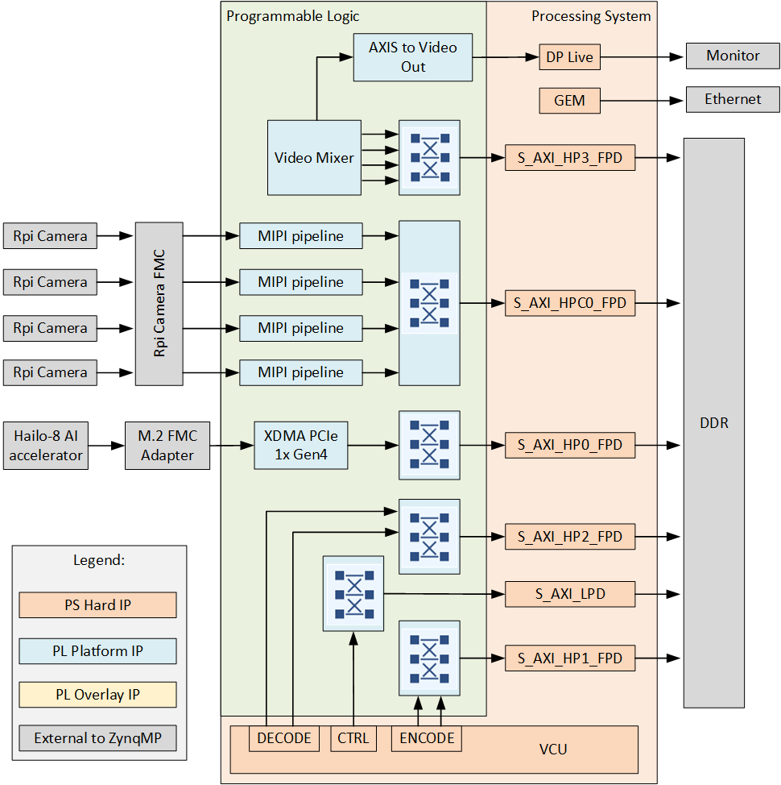
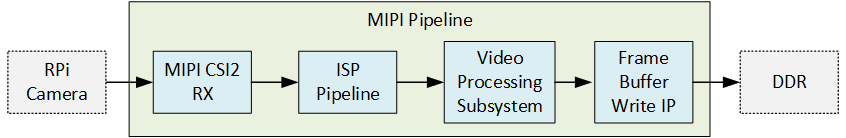
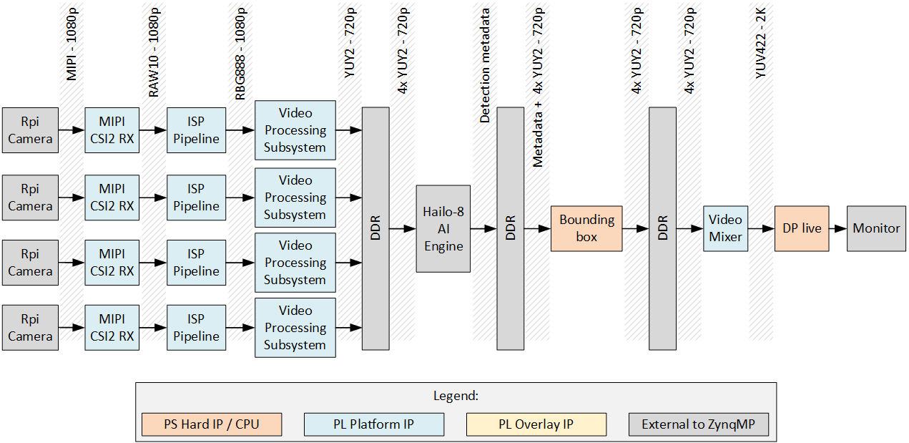

# Description

This project demonstrates multi-camera YOLOv5 accelerated by the Hailo-8 on the Zynq UltraScale+.
The setup has 4x Raspberry Pi cameras and can run on a few different Zynq UltraScale+ development
platforms. Cameras are connected to the Zynq UltraScale+ development boards via the Opsero [RPi Camera FMC]. 
The [Hailo-8 AI accelerator] connects to the development board via the [FPGA Drive FMC Gen4]
or the [M.2 M-key Stack FMC] depending on the target design 
(see list of [target designs](#target-designs)).

A detailed description of this example design has also been written in the blog post 
[Multi-camera YOLOv5 on Zynq UltraScale+ with Hailo-8 AI Acceleration](https://www.fpgadeveloper.com/multi-camera-yolov5-on-zynq-ultrascale-with-hailo-8-ai-acceleration/).

## Architecture

The block diagram below illustrates the design from the top level.

    
## Video pipe

The block diagram below illustrates the video pipe:

## End-to-end pipeline

The end-to-end pipeline shows the flow of image frames through the design from the source (cameras) to the sink (monitor).

[RPi Camera FMC]: https://camerafmc.com/docs/rpi-camera-fmc/overview/
[FPGA Drive FMC Gen4]: https://www.fpgadrive.com/docs/fpga-drive-fmc-gen4/overview/
[M.2 M-key Stack FMC]: https://www.fpgadrive.com/docs/m2-mkey-stack-fmc/overview/
[Hailo-8 AI accelerator]: https://hailo.ai/products/ai-accelerators/hailo-8-m2-ai-acceleration-module/

