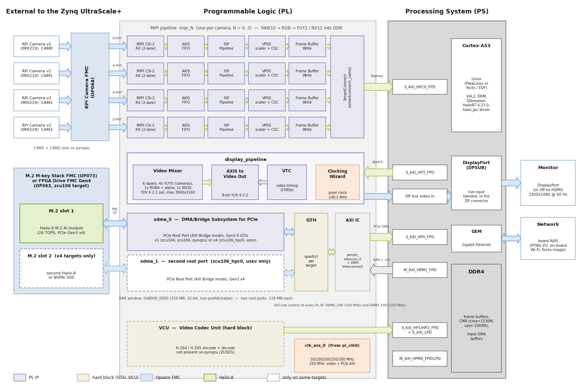
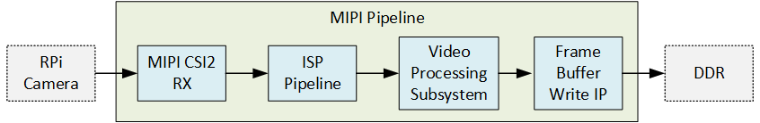
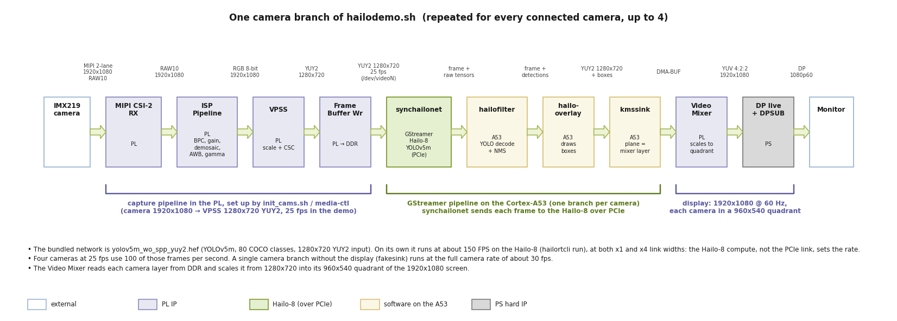

# Description

This project demonstrates multi-camera YOLOv5 accelerated by the Hailo-8 on the Zynq UltraScale+.
The setup has 4x Raspberry Pi cameras and can run on a few different Zynq UltraScale+ development
platforms. Cameras are connected to the Zynq UltraScale+ development boards via the Opsero [RPi Camera FMC]. 
The [Hailo-8 AI accelerator] connects to the development board via the [FPGA Drive FMC Gen4]
or the [M.2 M-key Stack FMC] depending on the target design 
(see list of [target designs](target-designs)).

A detailed description of this example design has also been written in the blog post 
[Multi-camera YOLOv5 on Zynq UltraScale+ with Hailo-8 AI Acceleration](https://www.fpgadeveloper.com/multi-camera-yolov5-on-zynq-ultrascale-with-hailo-8-ai-acceleration/).

## Hardware Platforms

The hardware designs provided in this reference are based on Vivado and support a range of MPSoC evaluation
boards. The repository contains all necessary scripts and code to build these designs for the supported platforms listed below:


    
    
        
            
        
    
    
### {{ group.name }} platforms

| Target board        | FMC Slot Used | Cameras | Active M.2 Slots | VCU |
|---------------------|---------------|---------|-----|-----|
| [{{ design.board }}]({{ design.link }}) | {{ design.connector }} | {{ design.cams | length }} | {{ design.lanes | length }} |  ✅  ❌  |




## Software

These reference designs run embedded Linux, built either with PetaLinux or with the
Yocto / EDF flow. The repository includes all necessary scripts and code to build both. The
table below outlines the applications available in each environment:

| Environment      | Available Applications  |
|------------------|-------------------------|
| PetaLinux        | Built-in Linux commands Hailo: HailoRT 4.23.0 (`hailortcli`, `pyhailort`, `hailo_pci` driver), Hailo GStreamer elements Demo scripts: `init_cams.sh`, `displaycams.sh`, `hailodemo.sh` + YOLOv5m HEF Additional tools: [GStreamer], `v4l-utils`, `modetest`, `nvme-cli` |
| Yocto / EDF      | Same as PetaLinux, plus Wi-Fi station support on the PYNQ-ZU |

## Architecture

The hardware design for these projects is built in Vivado and is composed of IP that implement the
MIPI interface with the cameras and VCU as well as a display pipeline. For interface with the Hailo AI
accelerator, the designs contain the XDMA IP, configured as a PCIe root port.
The main elements are:

* 4x Raspberry Pi cameras each with an independent MIPI capture pipeline that writes to the DDR
  (2x on the `pynqzu` target)
* Video Mixer based display pipeline that writes to the DisplayPort live interface of the ZynqMP,
  at 1920x1080 and 60 Hz
* One or two PCIe root ports ([XDMA] in AXI Bridge mode) to the M.2 slots of the FMC card,
  Gen3 x1 or x4 depending on the target
* Video Codec Unit ([VCU]), on the targets whose device has one

The block diagram below illustrates the design from the top level. The blocks drawn with
a dashed border exist only on some targets.

The diagrams on this page are generated by `docs/source/images/gen_block_diagram.py` from
the facts in `Vivado/src/bd/bd_zynqmp.tcl`.
    
### Capture pipeline

There are four main capture/input pipelines in this design, one for each of the 4x Raspberry Pi cameras. 
The capture pipelines are composed of the following IP, implemented in the PL of the Zynq UltraScale+:

* [MIPI CSI-2 Receiver Subsystem IP](https://docs.xilinx.com/r/en-US/pg232-mipi-csi2-rx)
* [AXI4-Stream Data FIFO](https://docs.amd.com/r/en-US/pg085-axi4stream-infrastructure/AXI4-Stream-Data-FIFO)
* [ISP Pipeline of the Vitis Libraries](https://github.com/Xilinx/Vitis_Libraries/tree/main/vision/L3/examples/isppipeline)
* [Video Processing Subsystem IP](https://docs.xilinx.com/r/en-US/pg231-v-proc-ss)
* [Frame Buffer Write IP](https://docs.xilinx.com/r/en-US/pg278-v-frmbuf)

The MIPI CSI-2 RX IP is the front of the pipeline and receives image frames from the Raspberry Pi camera 
over the 2-lane MIPI interface. The MIPI IP generates an AXI-Streaming output of the frames in RAW10 format. The 
ISP Pipeline IP performs BPC (Bad Pixel Correction), gain control, demosaicing, auto white balance
and gamma correction, to output 
the image frames in RGB888 format. The Video Processing Subsystem IP performs scaling and color space conversion 
(when needed). The Frame Buffer Write IP then writes the frame data to memory (DDR). The image below illustrates 
the MIPI pipeline. 

The ISP settings (per-channel gamma, gains, white-balance threshold) are V4L2 controls of the
ISP sub-device and can be changed at runtime; see
[Fine-tune the camera picture](isp-controls).

### Display pipeline

The Video Mixer reads up to four camera layers (YUYV), one RGBA overlay layer with alpha
and an NV16 primary layer from DDR, scales and blends them, and streams the result as
8-bit YUV 4:2:2 to the DisplayPort live video input of the Zynq UltraScale+ PS. A Video
Timing Controller generates the 1080p timing, and a Clocking Wizard with dynamic
reconfiguration produces the pixel clock. The Linux DRM driver of the Video Mixer sets the
mode; the Clocking Wizard then runs at 148.5 MHz for 1920x1080 at 60 Hz. The display
pipeline of this design supports that mode only, and the demo scripts select it
explicitly.

### PCIe interface to the M.2 slots

Each M.2 slot that a target uses is driven by its own instance of the DMA/Bridge Subsystem
for PCI Express (XDMA), configured as a root port in AXI Bridge mode, with a maximum link
speed of Gen3 (8 GT/s). The GT lanes come from the FMC connector, so the link width
depends on how many GT lanes the connector carries:

* `zcu104` and `pynqzu` (LPC) and `zcu106` (HPC1 with the [FPGA Drive FMC Gen4]) carry one
  GT lane to the M.2 adapter: **one root port, Gen3 x1, M.2 slot 1 only**. On `zcu106` the
  second M.2 slot of the FPGA Drive FMC Gen4 is not connected and cannot be used.
* `zcu106_hpc0` and `uzev` (HPC) carry enough GT lanes for two x4 links: **two root ports,
  Gen3 x4 each**.
  Slot 1 holds the Hailo-8; slot 2 can take a second Hailo-8 or an NVMe SSD.

The Hailo-8 runs the bundled YOLOv5m network at about 150 FPS on both link widths: the
module's compute, not the PCIe link, sets the rate.

(pcie-address-map)=
### PCIe address map

The PS reaches the PCIe devices through the AXI BAR window of each root port, on the
`M_AXI_HPM1_FPD` port. The window is placed in the **32-bit** address space at
`0xB000_0000` (256 MB; 128 MB per root port on the targets with two root ports) and maps
1:1 to the same PCIe address. The Linux device tree then describes it as a 32-bit
non-prefetchable memory window. This matters for NVMe SSDs: their BAR0 is a
non-prefetchable memory BAR, which a PCIe bridge can only place in a non-prefetchable
window below 4 GB. With a window above 4 GB (as in earlier versions of this design) an SSD
in the second M.2 slot trained its link but could not be enumerated. The Hailo-8 has only
prefetchable BARs and works with either. Bus-master traffic from the root ports (the DMA
of the Hailo-8 or SSD into DDR) enters the PS on `S_AXI_HP0_FPD`.

### End-to-end pipeline

The end-to-end pipeline shows the flow of image frames through the Hailo demo
(`hailodemo.sh`), from the camera to the monitor, with the resolution and pixel format at
each interface. The resolution and pixel format can be changed at the output of the RPi
camera and of the scaler (Video Processing Subsystem IP).

### Video Codec Unit

For some of the target boards, the Zynq UltraScale+ device contains a hardened Video Codec Unit (VCU) that can be used to
perform video encoding and decoding of multiple video standards. On those target designs, we have included the VCU to 
enable these powerful features. Refer to the list of target designs to see which boards support this feature.

[AMD Xilinx MIPI CSI Controller Subsystem IP]: https://docs.xilinx.com/r/en-US/pg202-mipi-dphy
[RPi Camera FMC]: https://docs.opsero.com/op068/datasheet/overview/
[FPGA Drive FMC Gen4]: https://docs.opsero.com/op063/datasheet/overview/
[M.2 M-key Stack FMC]: https://docs.opsero.com/op073/datasheet/overview/
[Hailo-8 AI accelerator]: https://hailo.ai/products/ai-accelerators/hailo-8-m2-ai-acceleration-module/
[XDMA]: https://www.xilinx.com/products/intellectual-property/pcie-dma.html
[GStreamer]: https://gstreamer.freedesktop.org/
[VCU]: https://xilinx-wiki.atlassian.net/wiki/spaces/A/pages/18842546/Xilinx+Zynq+UltraScale+MPSoC+Video+Codec+Unit
[G-Streamer plugins]: https://xilinx.github.io/VVAS/2.0/build/html/docs/common/common_plugins.html
