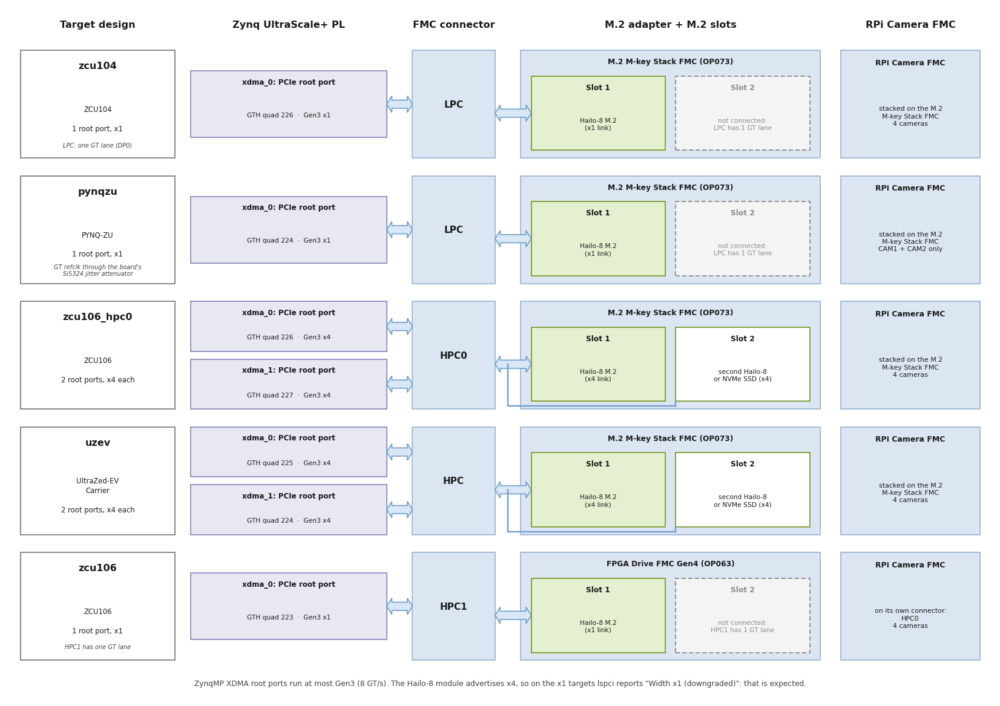

(run-and-test)=
# Run and test the design

This page applies to both Linux flows. Once you have booted your board with the
[PetaLinux](petalinux) or the [Yocto](yocto) image, the commands below take you from a first
check of the hardware to the full multi-camera YOLOv5 demo on the monitor. Run them in
the order given: the early steps need neither cameras nor a monitor, so if something is
wrong you will find out which part is at fault.

The outputs shown below are from a ZCU104 (`zcu104` target) and a ZCU106 (`zcu106_hpc0`
target) running the Yocto image with a Hailo-8 M.2 module (HM218B1C2FA) and four
Raspberry Pi Camera Module 2. Serial numbers, addresses and timings will differ on your
setup.

## Hardware setup

1. Fit the Hailo-8 M.2 module in **M.2 slot 1** of the M.2 adapter: the
   [M.2 M-key Stack FMC] on all targets except `zcu106`, where it is the
   [FPGA Drive FMC Gen4] (slot 1 is the only slot connected on that target, see
   [PCIe link per target](#pcie-link-per-target)).
2. On `zcu106_hpc0` and `uzev` you can optionally fit a second Hailo-8 or an NVMe SSD in
   **M.2 slot 2**.
3. Connect the Raspberry Pi Camera Module 2 cameras to the [RPi Camera FMC] (CAM0 to CAM3;
   CAM1 and CAM2 only on `pynqzu`).
4. Plug the FMC cards into the board:
   * **Stack designs** (`zcu104`, `zcu106_hpc0`, `pynqzu`, `uzev`): the [RPi Camera FMC]
     stacked on top of the [M.2 M-key Stack FMC], on the FMC connector listed in the
     [target designs](target-designs) table.
   * **`zcu106`**: the [RPi Camera FMC] on HPC0 and the [FPGA Drive FMC Gen4] on HPC1.
5. Connect a DisplayPort monitor (or an HDMI monitor through an active DP-to-HDMI
   adapter) that supports **1920x1080 at 60 Hz**.
6. Connect the USB-UART of the board to your PC and open a terminal at 115200 baud, 8N1.
7. Optionally connect the board's Ethernet port to your network (the images run a DHCP
   client and an SSH server). PYNQ-ZU has no Ethernet port; the Yocto image can use its
   on-board Wi-Fi instead (see [PYNQ-ZU Wi-Fi](pynq-zu-wi-fi)).
8. Power up the board.

## Log in

| Flow      | Hostname                    | User       | First login                                   |
|-----------|-----------------------------|------------|-----------------------------------------------|
| PetaLinux | `<board>-hailo-2025-2`      | `petalinux` | you are asked to set a password              |
| Yocto     | `<board>-hailo-2025-2`      | `amd-edf`  | you are asked to set a new password           |

`<board>` is `zcu104`, `zcu106`, `pynqzu` or `uzev`. Most of the commands below need
`sudo`, which asks for the same password. `/dev/hailo0` is accessible to root only, so
run `hailortcli` with `sudo`, and from a writable directory such as `/tmp` (HailoRT
writes a `hailort.log` into the current directory).

## 1. Check the PCIe link to the Hailo-8

```
lspci -nn
sudo lspci -d 1e60: -vv | grep -E 'LnkCap:|LnkSta:'
```

The Hailo-8 (vendor ID `1e60`, device ID `2864`) appears at bus 1 behind the XDMA root port.
On an x1 target (`zcu104`, `zcu106`, `pynqzu`):

```
01:00.0 Co-processor [0b40]: Hailo Technologies Ltd. Hailo-8 AI Processor [1e60:2864] (rev 01)
		LnkCap:	Port #0, Speed 8GT/s, Width x4, ASPM L0s L1, Exit Latency L0s <1us, L1 <2us
		LnkSta:	Speed 8GT/s, Width x1 (downgraded)
```

The module supports four lanes, so `lspci` reports the single-lane link as "downgraded".
On these targets that is expected. On `zcu106_hpc0` and `uzev` each slot has its own root
port and its own PCI domain (`0000:` and `0001:`), and the link trains to four lanes:

```
0000:00:00.0 PCI bridge [0604]: Xilinx Corporation SmartSSD [10ee:9134]
0000:01:00.0 Co-processor [0b40]: Hailo Technologies Ltd. Hailo-8 AI Processor [1e60:2864] (rev 01)
0001:00:00.0 PCI bridge [0604]: Xilinx Corporation SmartSSD [10ee:9134]
0001:01:00.0 Non-Volatile memory controller [0108]: Phison Electronics Corporation PS5021-E21 PCIe4 NVMe Controller (DRAM-less) [1987:5021] (rev 01)
```

(here with an NVMe SSD in slot 2; `lspci` names the root port after its Xilinx device ID).
The Zynq UltraScale+ root ports run at most **Gen3 (8 GT/s)**, so a Gen4 SSD also reports
"Speed 8GT/s (downgraded)".

(pcie-link-per-target)=
### PCIe link per target

| Target        | Root ports | Link to each M.2 slot | M.2 slot 2                                      |
|---------------|------------|-----------------------|-------------------------------------------------|
| `zcu104`      | 1          | Gen3 x1               | not connected (LPC has one GT lane)             |
| `pynqzu`      | 1          | Gen3 x1               | not connected (LPC has one GT lane)             |
| `zcu106`      | 1          | Gen3 x1               | not connected (HPC1 has one GT lane)            |
| `zcu106_hpc0` | 2          | Gen3 x4               | second Hailo-8 or NVMe SSD                      |
| `uzev`        | 2          | Gen3 x4               | second Hailo-8 or NVMe SSD                      |



## 2. Check the Hailo driver and firmware

```
ls -l /dev/hailo*
sudo dmesg | grep -i hailo
```

The `hailo_pci` driver loads the firmware into the module at boot and creates
`/dev/hailo0` (and `/dev/hailo1` for a second module):

```
hailo: Init module. driver version 4.23.0
hailo 0000:01:00.0: Probing on: 1e60:2864...
...
hailo 0000:01:00.0: NNC Firmware loaded successfully
hailo 0000:01:00.0: FW loaded, took 389 ms
hailo 0000:01:00.0: Probing: Added board 1e60-2864, /dev/hailo0
```

Then ask the device to identify itself:

```
cd /tmp
sudo hailortcli fw-control identify
hailortcli --version
```

```
Executing on device: 0000:01:00.0
Identifying board
Control Protocol Version: 2
Firmware Version: 4.23.0 (release,app,extended context switch buffer)
Logger Version: 0
Board Name: Hailo-8
Device Architecture: HAILO8
Serial Number: <your module's serial number>
Part Number: HM218B1C2FA
Product Name: HAILO-8 AI ACCELERATOR M.2 M KEY MODULE

HailoRT-CLI version 4.23.0
```

```{important}
The driver version (dmesg), the firmware version (`fw-control identify`) and the
HailoRT version (`hailortcli --version`) must all be the same: **4.23.0** in this
release. The images ship all three from the same HailoRT release, together with a HEF
compiled for it. If you replace any of them, see
[HailoRT version mismatch](hailort-version-mismatch).
```

## 3. Run inference on the Hailo-8

The image ships a YOLOv5m network compiled for the Hailo-8:
`/usr/bin/resources/yolov5m_wo_spp_yuy2.hef` (80 COCO classes, 1280x720 YUY2 input).
`hailortcli run` streams generated input frames through it, so no camera is needed:

```
cd /tmp
sudo hailortcli run /usr/bin/resources/yolov5m_wo_spp_yuy2.hef
```

```
Running streaming inference (/usr/bin/resources/yolov5m_wo_spp_yuy2.hef):
  Transform data: true
    Type:      auto
    Quantized: true
Network yolov5m_wo_spp_yuy2/yolov5m_wo_spp_yuy2: 100% | 750 | FPS: 149.80 | ETA: 00:00:00
> Inference result:
 Network group: yolov5m_wo_spp_yuy2
    Frames count: 750
    FPS: 149.81
    Send Rate: 2208.98 Mbit/s
    Recv Rate: 2591.52 Mbit/s
```

Expect about **150 FPS** for this network. The rate is the same on the x1 and the x4
targets: it is set by the Hailo-8 compute, not by the PCIe link.

## 4. Check the cameras

```
v4l2-ctl --list-devices
```

There is one `vcap_mipi_<n>_v_proc` video device and one media device per connected
camera (`<n>` is the CAM port number):

```
Xilinx Video Composite Device (platform:amba_pl:vcap_mipi_0_v_):
	/dev/media0
...
vcap_mipi_0_v_proc output 0 (platform:vcap_mipi_0_v_proc:0):
	/dev/video0
...
vcap_mipi_3_v_proc output 0 (platform:vcap_mipi_3_v_proc:0):
	/dev/video3
```

Only the cameras that are physically connected are listed. The `/dev/videoN` and
`/dev/mediaN` numbers are assigned at boot and do not always match the CAM port number:
use the output of `init_cams.sh` (next step) to map CAM ports to device nodes.

## 5. Configure the capture pipelines

`init_cams.sh` finds every camera on the [RPi Camera FMC] and uses `media-ctl` to set the
format of each pipeline (sensor, MIPI CSI-2 RX, ISP and VPSS). Without arguments, it
sets 1920x1080 at the camera and 1920x1080 YUY2 at the VPSS output:

```
sudo init_cams.sh
```

```
-------------------------------------------------
 Capture pipeline init: RPi cam -> Scaler -> DDR
-------------------------------------------------
Configuring all video capture pipelines to:
 - RPi Camera output    : 1920 x 1080
 - Scaler (VPSS) output : 1920 x 1080 YUY2
Video Mixer found here:
 - a0000000.v_mix
Detected and configured the following cameras on RPi Camera FMC:
 - CAM0: /dev/media0 = /dev/video0
 - CAM1: /dev/media1 = /dev/video1
 - CAM2: /dev/media2 = /dev/video2
 - CAM3: /dev/media3 = /dev/video3
```

The script takes optional arguments: camera width and height, VPSS output width and
height, and output format (`YUY2` or `NV12`). For example, `sudo init_cams.sh 1920 1080
1280 720 YUY2` gives 1280x720 frames. The IMX219 driver supports 640x480, 1640x1232 and
1920x1080 at the camera.

## 6. Capture frames from a camera

With the pipelines configured by `init_cams.sh` (1920x1080 YUY2), capture 30 frames from
one camera into a file:

```
sudo v4l2-ctl -d /dev/video0 --set-fmt-video=width=1920,height=1080,pixelformat=YUYV \
     --stream-mmap=4 --stream-count=30 --stream-to=/tmp/video0.yuv
ls -l /tmp/video0.yuv
```

The file holds 30 x 1920 x 1080 x 2 = 124416000 bytes. `v4l2-ctl` reports a frame rate of
about 12 to 14 fps here because it writes every frame to the file; the cameras run at
30 fps. `/tmp` is in RAM, so delete the file when you are done
(`sudo rm /tmp/video0.yuv`).

## 7. Run a camera through the Hailo-8 without a monitor

This GStreamer pipeline takes one camera, runs YOLOv5m on the Hailo-8 and the YOLO
post-processing on the Cortex-A53, and measures the frame rate. It needs no monitor. The
network expects 1280x720 frames, so first set the VPSS output of the camera's pipeline to
1280x720 (here for `/dev/media0` and `/dev/video0` from the `init_cams.sh` output):

```
sudo init_cams.sh 1920 1080 1280 720 YUY2
cd /tmp
sudo gst-launch-1.0 -v v4l2src device=/dev/video0 io-mode=mmap num-buffers=300 ! \
  video/x-raw,width=1280,height=720,format=YUY2 ! \
  synchailonet hef-path=/usr/bin/resources/yolov5m_wo_spp_yuy2.hef ! \
  hailofilter config-path=/usr/bin/resources/configs/yolov5.json \
              so-path=/usr/lib/hailo-post-processes/libyolo_hailortpp_post.so qos=false ! \
  fpsdisplaysink video-sink=fakesink text-overlay=false sync=false
```

The `fpsdisplaysink` messages show the camera rate with no dropped frames, and the
pipeline stops after 300 frames (about 10 seconds):

```
/GstPipeline:pipeline0/GstFPSDisplaySink:fpsdisplaysink0: last-message = rendered: 48, dropped: 0, current: 29.93, average: 30.69
...
Got EOS from element "pipeline0".
```

Expect about **30 fps** with `dropped: 0`. To run all connected cameras at once, repeat
the branch (from `v4l2src` to `fpsdisplaysink`) once per `/dev/videoN` in the same
`gst-launch-1.0` command.

## 8. Run the multi-camera demo on the monitor

```
sudo hailodemo.sh
```

The script:

1. configures every connected camera for 1920x1080 at the sensor and **1280x720 YUY2 at
   25 fps** at the VPSS output (the input size of the bundled network),
2. sets the display to **1920x1080 at 60 Hz**,
3. builds and starts one GStreamer branch per camera:
   `v4l2src` → `synchailonet` (YOLOv5m on the Hailo-8) → `hailofilter` (YOLO
   post-processing) → `hailooverlay` (draws the boxes and labels) → `kmssink` on one
   Video Mixer layer. The mixer scales each stream into one **960x540 quadrant** of the
   screen.

```
-------------------------------------------------
 Capture pipeline init: RPi cam -> Scaler -> DDR
-------------------------------------------------
Configuring all video capture pipelines to:
 - RPi Camera output    : 1920 x 1080
 - Scaler (VPSS) output : 1280 x 720 YUY2
 - Frame rate           : 25 fps
Video Mixer found here:
 - a0000000.v_mix
Monitor resolution:
 - 1920x1080
Detected and configured the following cameras on RPi Camera FMC:
 - CAM0: /dev/media0 = /dev/video0
 ...
setting mode 1920x1080-60.00Hz on connectors 49, crtc 47
GStreamer command:
--------------------------
gst-launch-1.0 -v v4l2src device=/dev/video0 io-mode=dmabuf-import ...
--------------------------
Setting pipeline to PAUSED ...
Pipeline is live and does not need PREROLL ...
...
Setting pipeline to PLAYING ...
```

The monitor shows the live camera pictures with a box and a label around each detected
object (people, cars, cups, chairs and the other COCO classes). Press `Ctrl+C` to stop
the demo. The connector and CRTC numbers may differ on your board; the script finds them
itself.

To see the cameras on the monitor without the Hailo-8, run `sudo displaycams.sh`. It
shows every connected camera at 960x540 and 30 fps in a quadrant of the same 1920x1080
screen.

```{note}
The display pipeline of this design is built for **1920x1080 at 60 Hz**: the
Video Timing Controller and the pixel clock (the Clocking Wizard in the display
pipeline, 148.5 MHz for this mode) only produce this mode. Both scripts set it
explicitly, whatever the monitor's preferred mode is. A monitor that does not accept
1920x1080 at 60 Hz will stay black.
```

## 9. Use an NVMe SSD in the second M.2 slot

On `zcu106_hpc0` and `uzev`, M.2 slot 2 has its own Gen3 x4 root port. Fit an NVMe SSD
there (with the Hailo-8 in slot 1) and check it after boot:

```
lspci -nn | grep -i 'non-volatile'
sudo nvme list
lsblk
```

The SSD appears as `/dev/nvme0n1`. A quick read test that does not modify the SSD:

```
sudo dd if=/dev/nvme0n1 of=/dev/null bs=1M count=1024 iflag=direct
```

To use the SSD for storage, partition and format it as you would on any Linux machine
(for example `sudo mkfs.ext4 /dev/nvme0n1p1` after creating a partition with `fdisk`);
this erases the data on the SSD.

The NVMe controller's BAR0 is a non-prefetchable memory BAR. The root ports' memory
windows are therefore placed in the 32-bit address space (0xB000_0000, see
[PCIe address map](pcie-address-map)) so that Linux can assign it. If
`nvme list` shows nothing, check the kernel log for unassigned resources:

```
sudo dmesg | grep -iE "can't assign|failed to assign"
```

No output is the expected result. Lines that name the SSD mean the image was built from
a version of the design that did not have this address map; rebuild it from this
release.

A second Hailo-8 in slot 2 appears as `/dev/hailo1`, at PCIe address `0001:01:00.0`. With
two modules fitted, select the module in `hailortcli` with its device-selection option
(see `hailortcli fw-control identify --help`).

## 10. Check the kernel log

After the steps above, the kernel log should have no Hailo, PCIe or video errors:

```
sudo dmesg | grep -iE 'error|fail|timeout' | \
  grep -iE 'hailo|xdma|pcie|AER|BAR [0-9]|bridge window|video|csi|imx219|v_proc|v_mix|mixer|drm|dpsub'
```

Two kinds of lines are normal and can be ignored:

* `vcap_mipi_<n>_v_proc: ... port@0 initialization failed` together with
  `DMA initialization failed`, about 3 seconds into boot: each capture pipeline is probed
  before its sensor driver and binds on the retry (the cameras are listed by
  `v4l2-ctl --list-devices`).
* `xilinx-csi2rxss ...: Stream Line Buffer Full!` when a GStreamer pipeline is stopped.

(isp-controls)=
## Fine-tune the camera picture (ISP controls)

Each capture pipeline has an ISP (the `ISPPipeline_accel` block) with its own V4L2
sub-device. It performs bad pixel correction, gain, demosaicing, auto white balance and
gamma correction. List the ISP sub-devices and their controls:

```
for s in /dev/v4l-subdev*; do
  n=$(cat /sys/class/video4linux/$(basename $s)/name)
  case "$n" in *ISPPipeline*) echo "$s  $n"; sudo v4l2-ctl -d $s -l;; esac
done
```

| Control       | Default | Description                                                         |
|---------------|---------|---------------------------------------------------------------------|
| `red_gamma`, `green_gamma`, `blue_gamma` | 20 | gamma curve of each colour channel, in tenths (20 = gamma 2.0, range 1 to 40) |
| `red_gain`, `blue_gain` | 128, 210 | gains applied before white balance (from `xlnx,rgain` / `xlnx,bgain` in the device tree) |
| `threshold`   | 350     | auto white balance threshold (from `xlnx,pawb` in the device tree)  |
| `awb_en`      | 1       | auto white balance on/off                                           |

Change a control on a running pipeline, for example:

```
sudo v4l2-ctl -d /dev/v4l-subdev2 --set-ctrl=red_gamma=18,green_gamma=18,blue_gamma=18
```

The auto white balance is a "grey world" algorithm: it assumes the average of the scene is
grey. A scene dominated by one colour (for example a room lit by a warm lamp) therefore
keeps a warm tint; that is the scene, not a fault. If every camera shows a magenta or
pink tint on white and grey objects, see
[Magenta tint on the camera pictures](magenta-tint-on-the-camera-pictures).

[RPi Camera FMC]: https://docs.opsero.com/op068/datasheet/overview/
[FPGA Drive FMC Gen4]: https://docs.opsero.com/op063/datasheet/overview/
[M.2 M-key Stack FMC]: https://docs.opsero.com/op073/datasheet/overview/
